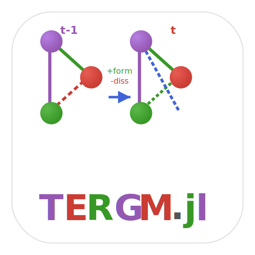

# TERGM.jl

[](https://github.com/statistical-network-analysis-with-Julia/TERGM.jl)
[](https://github.com/statistical-network-analysis-with-Julia/TERGM.jl/actions/workflows/CI.yml?query=branch%3Amain)
[](https://statistical-network-analysis-with-Julia.github.io/TERGM.jl/stable/)
[](https://statistical-network-analysis-with-Julia.github.io/TERGM.jl/dev/)
[](https://julialang.org/)
[](https://opensource.org/licenses/MIT)

<p align="center">
  
</p>

A Julia implementation of **Temporal Exponential Random Graph Models** for statistical modeling of dynamic networks using Separable Temporal ERGMs (STERGMs).

## Overview

Temporal ERGMs extend the ERGM framework to dynamic networks observed at multiple time points. TERGM.jl focuses on the Separable Temporal ERGM (STERGM), which decomposes network change into two separate processes:

- **Formation effects**: What drives new tie creation (reciprocity, triadic closure, homophily)
- **Dissolution effects**: What drives tie persistence (mutual ties, edge stability, memory)
- **Temporal effects**: Edge stability, delayed reciprocity, memory, edge age
- **Standard ERGM terms**: Use any ERGM.jl term in formation or dissolution models

TERGM.jl is a port of the R [tergm](https://cran.r-project.org/package=tergm) package from the [StatNet](https://statnet.org/) collection.

## Installation

```julia
using Pkg
Pkg.add(url="https://github.com/statistical-network-analysis-with-Julia/TERGM.jl")
```

## Temporal Terms Implemented

### 1. Edge Dynamics Terms

Terms capturing edge persistence and formation between time points.

```julia
EdgeStability()      # Edges persisting from previous time step
PersistentEdge()     # Same as EdgeStability
NewEdge()            # Edges not present at previous time step
```

### 2. Memory Terms

Terms capturing memory effects and edge age.

```julia
Memory(theta)        # Weighted memory of previous state
EdgeAge()            # Age of edges (how many time steps persisted)
EdgeAge(max_age=5)   # Cap age at 5 time steps
```

### 3. Reciprocity Terms

Terms capturing delayed reciprocity across time.

```julia
Delrecip()           # Delayed reciprocity (reciprocate previous edges)
```

### 4. Lagged Terms

Apply standard ERGM terms to the previous network.

```julia
TimeLag(Edges())     # Lagged edge count
TimeLag(Triangle())  # Lagged triangle count
```

### 5. Formation/Dissolution Wrappers

Wrap standard ERGM terms for specific sub-models.

```julia
FormationTerm(Edges())      # Apply only to formation
DissolutionTerm(Edges())    # Apply only to dissolution
```

## Usage

### Basic Example

```julia
using Network
using ERGM
using TERGM

# Network sequence (panel data at 4 time points)
networks = [net_t1, net_t2, net_t3, net_t4]

# Define formation and dissolution terms
form_terms = [Edges(), Triangle()]
diss_terms = [Edges()]

# Fit STERGM via Conditional Maximum Likelihood
result = stergm(networks, form_terms, diss_terms)

# View results
println(result)
```

### Result Structure

The `stergm` function returns a `STERGMResult` with:

- `formation_coef::Vector{Float64}`: Formation coefficients (log-odds of edge formation)
- `dissolution_coef::Vector{Float64}`: Dissolution coefficients (log-odds of edge persistence)
- `formation_se::Vector{Float64}`: Standard errors for formation model
- `dissolution_se::Vector{Float64}`: Standard errors for dissolution model
- `method::Symbol`: Estimation method used
- `converged::Bool`: Whether optimization converged

```julia
# Access results
result.formation_coef    # Formation coefficients
result.dissolution_coef  # Dissolution (persistence) coefficients
result.formation_se      # Formation standard errors
result.dissolution_se    # Dissolution standard errors
```

### Estimation Methods

TERGM.jl supports multiple estimation methods:

```julia
# Conditional Maximum Likelihood (default, recommended)
result = stergm(networks, form_terms, diss_terms; method=:cmle)

# Conditional Maximum Pseudo-Likelihood (faster for large networks)
result = stergm(networks, form_terms, diss_terms; method=:cmple)

# Equilibrium Generalized Method of Moments (experimental)
result = stergm(networks, form_terms, diss_terms; method=:egmme)
```

### Simulation

Generate future network trajectories from fitted models:

```julia
# Simulate 10 future time steps
future_nets = simulate_stergm(result, 10)

# With burn-in period
future_nets = simulate_stergm(result, 10; burnin=100)

# Simulate from specified parameters
nets = simulate_network_sequence(
    formula, init_net, n_steps;
    form_coef=[-3.0, 1.0],
    diss_coef=[2.0]
)
```

### Goodness-of-Fit

Assess model fit by comparing observed and simulated network statistics:

```julia
gof = stergm_gof(result; n_sim=100)
println("Observed: ", gof.observed)
println("Simulated mean: ", gof.simulated_mean)
println("Z-scores: ", gof.z_scores)
```

### Example: Email Communication

```julia
# Weekly email networks
weeks = [email_week1, email_week2, email_week3, email_week4]

# Model: edges form/dissolve based on density and reciprocity
form = [Edges(), Mutual()]
diss = [Edges(), Mutual()]

result = stergm(weeks, form, diss)

# Positive formation mutual coefficient → reciprocity increases formation
# Positive dissolution mutual coefficient → reciprocity increases persistence
```

## Running Tests

```julia
include("test/runtests.jl")
```

## Documentation

For more detailed documentation, see:

- [Stable Documentation](https://statistical-network-analysis-with-Julia.github.io/TERGM.jl/stable/)
- [Development Documentation](https://statistical-network-analysis-with-Julia.github.io/TERGM.jl/dev/)

## References

1. Krivitsky, P. N., & Handcock, M. S. (2014). A separable model for dynamic networks. *Journal of the Royal Statistical Society: Series B*, 76(1), 29-46.

2. Krivitsky, P. N., & Handcock, M. S. (2023). Modeling of dynamic networks based on egocentric data with durational information. *Sociological Methodology*, 53(2), 250-286.

3. Robins, G., & Pattison, P. (2001). Random graph models for temporal processes in social networks. *Journal of Mathematical Sociology*, 25(1), 5-41.

4. Hanneke, S., Fu, W., & Xing, E. P. (2010). Discrete temporal models of social networks. *Electronic Journal of Statistics*, 4, 585-605.

## License

MIT License - see [LICENSE](LICENSE) for details.
