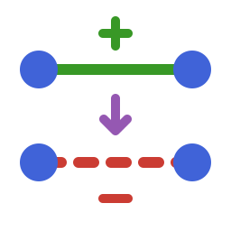

# TERGM.jl


[](https://github.com/statistical-network-analysis-with-Julia/TERGM.jl)
[](https://github.com/statistical-network-analysis-with-Julia/TERGM.jl/actions/workflows/CI.yml?query=branch%3Amain)
[](https://statistical-network-analysis-with-Julia.github.io/TERGM.jl/stable/)
[](https://statistical-network-analysis-with-Julia.github.io/TERGM.jl/dev/)
[](https://julialang.org/)
[](https://opensource.org/licenses/MIT)

<p align="center">
  
</p>

Separable Temporal ERGMs (STERGM) in Julia — a port of the R `tergm`
package (Krivitsky & Handcock 2014).

## Installation

Requires Julia 1.12+. The packages are not yet registered, so they are
added by URL; TERGM.jl depends on
[Networks.jl](https://github.com/statistical-network-analysis-with-Julia/Networks.jl)
and [ERGM.jl](https://github.com/statistical-network-analysis-with-Julia/ERGM.jl),
which must be added first, in this order:

```julia
using Pkg
Pkg.add(url="https://github.com/statistical-network-analysis-with-Julia/Networks.jl")
Pkg.add(url="https://github.com/statistical-network-analysis-with-Julia/ERGM.jl")
Pkg.add(url="https://github.com/statistical-network-analysis-with-Julia/TERGM.jl")
```

For development, clone the repositories side by side — `Networks.jl`,
`ERGM.jl` and `TERGM.jl` in one directory, each under its own name — and
`Pkg.develop` this one; its `Project.toml` carries `[sources]` path
entries (`ERGM = {path = "../ERGM.jl"}`) that resolve the siblings from
that layout, so no ordered install is needed:

```julia
using Pkg
Pkg.develop(path="../TERGM.jl")   # from any environment in the clone directory
```

`julia --project` inside the `TERGM.jl` clone activates the package's own
environment the same way. (The organisation site will publish a
ready-made development workspace that `dev`s every package at once; until
then the side-by-side layout above is the documented one.)

## The separable model

Each transition Y_{t−1} → Y_t factors into:

- a **formation** model on the formation network **Y⁺ = Y_{t−1} ∪ Y_t**
  (free dyads: the non-edges of Y_{t−1});
- a **dissolution** model on the dissolution network **Y⁻ = Y_{t−1} ∩ Y_t**
  (free dyads: the edges of Y_{t−1}), parameterized as **persistence** —
  positive coefficients mean ties last longer.

`formation_network` / `dissolution_network` expose the auxiliary
construction directly. Formation and dissolution models take any mix of
standard ERGM.jl terms (evaluated on Y⁺/Y⁻) and the temporal term
`Delrecip` (delayed reciprocity, which also conditions on Y_{t−1}). The
other three temporal terms — `EdgeStability`, `PersistentEdge`, `NewEdge`
— are **descriptives only**: on the free dyads of a separable model their
change statistic is `±edges` or identically zero, so a formula containing
one is refused at construction with an `ArgumentError` that says so (see
[Temporal terms](https://statistical-network-analysis-with-Julia.github.io/TERGM.jl/dev/guide/terms/)).

## Coming from R tergm

| R `tergm` (≥ 4) | TERGM.jl |
|---|---|
| `tergm(nets ~ Form(~edges + mutual) + Persist(~edges), estimate = "CMPLE")` | `stergm(nets, [Edges(), Mutual()], [Edges()])` — the panel first, then the formation terms, then the persistence terms |
| `Form(~…)` / `Persist(~…)` | the second / third argument (two term vectors) |
| `Diss(~…)` | not offered: `persistence_coef` is `Persist()`'s sign; `Diss()` is its negation |
| `estimate = "CMPLE"` | the only estimator; `estimate = "CMLE"` (MCMC) and EGMME throw |
| `summary(fit)` | `coeftable(fit)` (rows `Form(1)~edges`, …) or `println(fit)` |
| `gof(fit)` | `gof(fit)` (tie changes, model statistics, degree distributions) |
| `simulate(fit, nsim = 1, time.slices = k)` | `simulate_stergm(fit, k)` — one chain, `k` steps forward from the last panel (tergm's `nsim` counts *replications*, `time.slices` the steps per replication) |
| `simulate(fit, nsim = k)` (`k` independent one-step draws) | `[simulate_stergm(fit, 1; rng = rng)[end] for _ in 1:k]` |
| `nodefactor("grp")`, `nodemix("grp")`, `degree(0:2)` | `NodeFactor(:grp)`, `NodeMix(:grp)`, `Degree(0:2)` — expanded to one coefficient per level / cell / degree under R's labels (`nodefactor.grp.b`, `mix.grp.a.b`, `degree1`), exactly as `fit_ergm` expands them |
| `nw ~ edges + mutual` on one cross-section | `ERGM.fit_ergm` — a STERGM needs a panel of ≥ 2 networks |
| `stergm(nw, formation = ~…, dissolution = ~…)` (deprecated in R) | the closer spelling: the same two term vectors |

## Quick Start

The panel is RSiena's `s50` excerpt (50 girls, three yearly waves of
directed friendship nominations), shipped by Networks.jl as
`load_dataset(:s50)`; the smoking behaviour at wave 1 becomes a vertex
attribute so `NodeMatch(:smoke)` can ask whether ties between girls with
the same smoking status form and last differently.

```julia
using TERGM, ERGM, Networks, Random

s50 = load_dataset(:s50)                       # (friendship, alcohol, smoke)
networks = [copy(w) for w in s50.friendship]   # three Network{Int,true} panels
for w in networks, v in 1:nv(w)
    set_vertex_attribute!(w, :smoke, v, s50.smoke[v, 1])
end

# R tergm: tergm(nets ~ Form(~edges + mutual + nodematch("smoke")) +
#                       Persist(~edges + nodematch("smoke")), estimate = "CMPLE")
# fit_stergm is the standardized alias (fit_<model> naming)
result = stergm(networks,
                [Edges(), Mutual(), NodeMatch(:smoke)],   # formation model  (Form)
                [Edges(), NodeMatch(:smoke)])             # dissolution (persistence) model  (Persist)
println(result)
result.model               # one line: panels, size, free dyads, both formulas

formation_coef(result)     # log-odds of a prior non-tie forming
persistence_coef(result)   # log-odds of a prior tie persisting (tergm Persist())

# The full StatsAPI surface: coef, stderror, vcov, confint, loglikelihood,
# nobs, dof, aic, bic, coeftable — labelled as summary(tergm) labels them
coeftable(result)          # rows Form(1)~edges, …, Persist(1)~nodematch.smoke
confint(result)            # Wald 95% limits, one row per coefficient
coeftable(result)["Persist(1)~nodematch.smoke"].p_value

# Simulate forward from the last panel
rng = Xoshiro(5)
future = simulate_stergm(result, 10; rng = rng)

# Transition-level goodness of fit — `gof(fit)` is the one verb of the model
# family (Networks.gof generic): tie changes, the formation/persistence model
# statistics on Y⁺/Y⁻ and the in/out-degree distributions, pooled over
# transitions; one seed per simulation drawn from rng, simulations on every thread
gof(result; n_sim = 100, rng = rng)
```

`Mutual` is dyad-dependent, so the printed fit carries a caveat: the
inverse-Hessian standard errors of a CMPLE are anticonservative there —
refit with `se = :bootstrap` for per-transition block-bootstrap ones.

## Estimation

The default (and honest) estimator is **CMPLE**: pooled logistic
pseudo-likelihood over the free dyads of the auxiliary networks. For
dyad-independent terms this *is* the conditional MLE; for dyad-dependent
terms (`Triangle`, `Mutual`, ...) it is an approximation. `method = :cmle`
**throws an `ArgumentError`** — MCMC-based CMLE is not implemented, and
CMPLE is not the same estimator except for dyad-independent formulas, so it
does not stand in silently — and `method = :egmme` throws an
`ErrorException` rather than fabricating estimates (EGMME is not
implemented; `egmme` is not exported, only reachable as `TERGM.egmme`).

`se = :bootstrap` swaps the naive pseudo-likelihood standard errors for a
per-transition block bootstrap (the `btergm` approach, run through the
ecosystem's one shared loop, `Networks.bootstrap_cov`): resample the
time-transitions with replacement, refit, and take the empirical
covariance of the coefficients (needs at least three panels; seed with
`rng`; `result.boot_replicates` holds the refits, and a replicate without a
finite refit is excluded with one warning). Fits of dyad-dependent formulas
with naive standard errors print an explicit caveat.

Nothing about a bad fit is silent. A fit that exhausts `maxiter` is
returned with `converged == false`, a warning, a caveat under `show`'s
tables and an entry in `approximations(result)`. (The verdict itself is
scale-free: a fit the shared Newton kernel stops at the log-likelihood's
floating-point noise floor is called converged only if the remaining
Newton decrement ½·gᵀ(−H)⁻¹g is below `tol`, in which case the last full
step is taken — so a `Triangle` formation model on the golden panel
converges exactly where R's `glm` does, pinned by the `dyaddep_triangle_*`
fixture keys.) A statistic at the
boundary of its attainable range (a `NodeMatch` no prior same-group tie of
which persists, say) has no finite CMPLE: as R ergm does (`drop=TRUE`),
`cmple` warns `observed statistic(s) Persist~nodematch.grp are at their
smallest attainable values. Their coefficients will be fixed at -Inf …`,
reports that coefficient as `-Inf` with standard error 0, and fits the
rest on the free dyads it does not touch (`dof` counts the finite
coefficients; `se = :bootstrap` is refused). A design separated by a
combination of statistics comes back `converged == false` with R's
warning (`The MPLE does not exist!`) instead of a point on the asymptote.
(R `tergm` 4.2 does not drop — its operator terms bypass ergm's check —
so it returns `-19.6` with a standard error of `1600` where TERGM.jl says
`-Inf`; the finite coefficients agree to 1e-6, pinned by the golden
fixture's boundary panel.)

The dissolution model is fit in tergm's **persistence** (`Persist()`)
parameterisation: `persistence_coef(result)` are log-odds of a prior tie
persisting (positive = ties last longer); tergm's `Diss()` coefficients are
their negation. The pre-0.2 `dissolution_coef`/`dissolution_se` spellings
are deprecated aliases of the same numbers.

## Missing data

A panel with masked (unobserved) dyads is **refused** at model construction
— `ArgumentError: TERGM (panel 2) does not support missing (unobserved)
dyads, but the network has 1 masked dyad. …`, naming the panel and
`clear_missing_dyads!` — and neither `stergm` nor `cmple`
takes a `missing=` keyword (`missing_policies(stergm) == (:error,)`,
`supports_missing(stergm) == false`, `missing_method(fit) == :rejected`).
There is no policy to opt into because CMPLE enumerates every free dyad of
Y⁺/Y⁻ as an observed logistic row: a masked dyad would enter the design at
its face value and be fitted as data. The constrained missing-data MCMLE
ERGM.jl has for a single network has no pseudo-likelihood analogue, so the
honest behaviour is to refuse; clear or impute the dyads yourself first.

## Inspecting a fit

`show(result)` prints the header (panels, transitions, free dyads, the
pseudo-log-likelihoods, `AIC: …, BIC: …` as `ERGMResult`'s header has it,
how the standard errors were obtained, `Converged: true/false` — an
unconverged fit says `WARNING:` right there, before any table), then one
R-style block per model, `Formation:` and `Persistence:`, rendered through
the ecosystem's shared `Networks.print_coeftable`. `result.model` (an
`STERGMModel`) and a `STERGM` formula print as one line — `STERGMModel{Int64,true}:
3 panels of 50 vertices (directed), 4900 free dyads; formation: edges +
mutual + nodematch.smoke; persistence: edges + nodematch.smoke` — never the
panels themselves. `coeftable(result)` returns the same
numbers as an inspectable `Networks.CoefficientTable`, one row per stacked
coefficient labelled as `summary(tergm)` labels them (`Form(1)~edges`,
`Persist(1)~nodematch.smoke`); `confint(result; level = 0.95)` gives Wald
limits from the standard errors the fit reports. The whole StatsAPI surface
— `coef`, `stderror`, `vcov`, `confint`, `loglikelihood`, `nobs`, `dof`,
`aic`, `bic`, `coeftable` — is defined on `STERGMResult` and pinned by
`Networks.check_statsapi(result; strict = true)` in the test suite.

## Deprecated (removed in the release after 0.2.0)

- `stergm_gof(result; ...)` → `gof(result; ...)` — one goodness-of-fit verb
  for the whole model family; the old name warns and forwards.
- `dissolution_coef(result)` / `dissolution_se(result)` and the
  `result.dissolution_coef` / `result.dissolution_se` properties →
  `persistence_coef` / `persistence_se` (same vectors, with a deprecation
  warning).

## Formula validation

Model construction validates both formulas against **every** panel with
ERGM.jl's own formula validation (`ERGM._validate_formula`), so a STERGM
formula is held to exactly the rules an ERGM formula is held to, and the
`ArgumentError` names the side, the panel, the term and the fix:

- a declared vertex attribute must exist on the panel **and be set on every
  vertex** (statnet refuses NA attribute values);
- `Mutual`/`Delrecip` are refused on undirected panels (`Delrecip` also
  throws from `compute`/`change_stat` on an undirected network rather than
  returning a silent `0.0`);
- `Kstar`/`GWDegree`/`Degree` are undirected-only, as in R: on directed
  panels use `OStar`/`IStar`, `GWODegree`/`GWIDegree`, `ODegree`/`IDegree`;
- an `EdgeCov` covariate matrix must be `n×n`.

Coefficient labels are R's, resolved against the panel: a directed panel's
`GWESP(0.5)` prints as `gwesp.OTP.fixed.0.5`.

Both formulas are then **expanded** exactly as `fit_ergm` expands an ERGM
formula (ERGM.jl's `_materialize`): a multi-level `NodeFactor(:grp)` becomes
one `nodefactor.grp.<level>` coefficient per non-base level, a multi-cell
`NodeMix(:grp)` one `mix.grp.<l1>.<l2>` per selected cell, and
`Degree(0:2)` / `IDegree` / `ODegree` one `degree<d>` per degree — the
columns and labels `tergm` prints (pinned by the golden fixture on both a
directed and an undirected panel). `result.model.formula` holds the
expanded, single-statistic terms; the levels are resolved from the first
panel, as `tergm` resolves them from the union of the panels: a level
absent from a later panel has an all-zero column on that transition, and
a later panel carrying a level the first one lacks is an `ArgumentError`
naming the panel and the value. Attribute values are read per transition
from the panel it starts at, so a time-varying attribute is honoured.

## Not implemented

- **MCMC-based CMLE and EGMME** (`method = :cmle` throws an `ArgumentError`,
  `method = :egmme` / `TERGM.egmme` an `ErrorException`). CMPLE is the one
  estimator; for dyad-dependent formulas it is an approximation, and the
  result says so (`is_exact(fit) == false`, `approximations(fit)`).
- **Missing (masked) dyads in a panel.** `STERGMModel` refuses any panel
  with masked dyads (`ArgumentError` naming the panel) and offers no
  `missing=` keyword — see [Missing data](#missing-data) above for why.
- **Two-mode (bipartite) panels.** `STERGMModel` refuses a panel built with
  `bipartite=` (`ArgumentError: TERGM (panel t): two-mode (bipartite) panels
  are not supported — the one-mode CMPLE would enumerate the impossible
  within-mode dyads as free dyads …`): bipartite terms and the two-mode
  free-dyad sets are not implemented, and a one-mode fit would silently
  bias the formation model (ERGM.jl refuses the same network).
- **Self-loops.** A panel containing a loop is refused (`ArgumentError:
  TERGM (panel t): the panel contains 1 self-loop (at vertex v) …`): the
  statistics would count it while the free dyads, `nobs` and the sampler
  range over off-diagonal dyads only. Remove it with `rem_edge!(net, v, v)`.
- **Non-separable (btergm-style) TERGMs.** The memory terms
  `EdgeStability`, `PersistentEdge` and `NewEdge` are constant on the free
  dyads of a separable model and are refused in a formula (`ArgumentError:
  formation model: term 'edge.stability' is constant on the free dyads …`);
  they remain available as descriptives (`compute(term, curr, prev)`).

An edges-only model reproduces the analytic formation/persistence
log-odds exactly, and simulation→estimation round trips recover both
coefficient vectors (tested).

## Temporal descriptives

`edge_ages(networks)` / `mean_edge_age(networks)` report how long the
final panel's ties have been in place.

## References

1. Krivitsky, P.N. & Handcock, M.S. (2014). A separable model for dynamic
   networks. *JRSS-B*, 76(1), 29-46.

2. Krivitsky, P.N. & Handcock, M.S. tergm: Fit, Simulate and Diagnose
   Models for Network Evolution Based on Exponential-Family Random Graph
   Models. R package.
   [https://cran.r-project.org/package=tergm](https://cran.r-project.org/package=tergm)

## Citation

If you use TERGM.jl in your work, please cite it using the entry in
[`CITATION.bib`](CITATION.bib):

```biblatex
@misc{SNWJTERGMJL,
  author = {{Statistical Network Analysis with Julia}},
  title = {TERGM.jl: Separable Temporal Exponential Random Graph Models in Julia},
  year = {2026},
  url = {https://github.com/statistical-network-analysis-with-Julia/TERGM.jl},
  note = {Homepage: https://statistical-network-analysis-with-Julia.github.io/TERGM.jl; GitHub: https://github.com/statistical-network-analysis-with-Julia}
}
```

## License

MIT License - see [LICENSE](LICENSE) for details.
