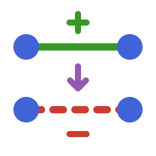

# TERGM.jl


[](https://github.com/statistical-network-analysis-with-Julia/TERGM.jl)
[](https://github.com/statistical-network-analysis-with-Julia/TERGM.jl/actions/workflows/CI.yml?query=branch%3Amain)
[](https://statistical-network-analysis-with-Julia.github.io/TERGM.jl/dev/)
[](https://julialang.org/)
[](https://opensource.org/licenses/MIT)

<p align="center">
  
</p>

Separable Temporal ERGMs (STERGM) in Julia — a port of the R `tergm`
package (Krivitsky & Handcock 2014).

## Installation

Requires Julia 1.12 or newer. The packages are not yet registered.

**Recommended: the ecosystem workspace.** It clones every package side by
side, develops them together in one environment, and adds the packages the
examples also use (CSV, DataFrames, Distributions, Graphs, StatsAPI,
StatsBase):

```bash
mkdir network-analysis && cd network-analysis
git clone https://github.com/statistical-network-analysis-with-Julia/statistical-network-analysis-with-Julia.github.io
julia statistical-network-analysis-with-Julia.github.io/tools/prepare_workspace.jl "$PWD" --clone
julia --project=.snippet-env
```

**Only this package, in your own environment.** Add its dependencies first,
in this order (the examples below load nothing beyond these and the
standard library):

```julia
using Pkg
Pkg.add(url="https://github.com/statistical-network-analysis-with-Julia/NetworkCore.jl")
Pkg.add(url="https://github.com/statistical-network-analysis-with-Julia/ERGM.jl")
Pkg.add(url="https://github.com/statistical-network-analysis-with-Julia/TERGM.jl")
```

## The separable model

Each transition Y_{t−1} → Y_t factors into:

- a **formation** model on the formation network **Y⁺ = Y_{t−1} ∪ Y_t**
  (free dyads: the non-edges of Y_{t−1});
- a **dissolution** model on the dissolution network **Y⁻ = Y_{t−1} ∩ Y_t**
  (free dyads: the edges of Y_{t−1}), parameterized as **persistence** —
  positive coefficients mean ties last longer.

`formation_network` / `dissolution_network` expose the auxiliary
construction directly. Formation and dissolution models take any mix of
standard ERGM.jl terms (evaluated on Y⁺/Y⁻) and the temporal term
`Delrecip` (delayed reciprocity, which also conditions on Y_{t−1}). The
other three temporal terms — `EdgeStability`, `PersistentEdge`, `NewEdge`
— are **descriptives only**: on the free dyads of a separable model their
change statistic is `±edges` or identically zero, so a formula containing
one is refused at construction with an `ArgumentError` that says so (see
[Temporal terms](https://statistical-network-analysis-with-Julia.github.io/TERGM.jl/dev/guide/terms/)).

## Coming from R tergm

| R `tergm` (≥ 4) | TERGM.jl |
|---|---|
| `tergm(nets ~ Form(~edges + mutual) + Persist(~edges))` | `stergm(nets, [Edges(), Mutual()], [Edges()])` — the panel first, then the formation terms, then the persistence terms |
| `Form(~…)` / `Persist(~…)` | the second / third argument (two term vectors) |
| `Diss(~…)` | not offered: `persistence_coef` is `Persist()`'s sign; `Diss()` is its negation |
| `estimate = "CMLE"` (R's `tergm()` requires `estimate=`; it has no default) | the default `method = :auto`: the CMLE (`method = :cmle`, Monte-Carlo conditional MLE) when a term is dyad-dependent, the CMPLE when none is — there the two are the same estimator and no MCMC is run |
| `estimate = "CMPLE"` | `method = :cmple` |
| `estimate = "EGMME"` | not implemented (`ArgumentError`) |
| `summary(fit)` of a CMPLE fit (naive Wald table) | `stergm(...; method = :cmple, se = :hessian)`; the CMPLE's default `se` withholds z and p for a dyad-dependent formula |
| `summary(fit)` | `coeftable(fit)` (rows `Form(1)~edges`, …) or `println(fit)` |
| `gof(fit)` | `gof(fit)` (tie changes, model statistics, degree distributions) |
| `simulate(fit, nsim = 1, time.slices = k)` | `simulate_stergm(fit, k)` — one chain, `k` steps forward from the last panel (tergm's `nsim` counts *replications*, `time.slices` the steps per replication) |
| `simulate(fit, nsim = k)` (`k` independent one-step draws) | `[simulate_stergm(fit, 1; rng = rng)[end] for _ in 1:k]` |
| `concurrent`, `degrange(2)`, `gwnsp(0.5, fixed=TRUE)` | `Concurrent()`, `DegRange(2)`, `GWNSP(0.5)` — every ERGM.jl term is a STERGM term |
| `offset(edges)` inside `Form()`/`Persist()` | refused, as `tergm` refuses it in a CMLE/CMPLE fit (it belongs to EGMME) |
| `btergm`-style bootstrap over time steps | `se = :block_bootstrap` (refused below 10 transitions); `se = :bootstrap` is the parametric bootstrap, as everywhere in the ecosystem |
| `cyclicalties`, `transitiveties` | `CyclicalTies()`, `TransitiveTies()` — the tergm tutorial's formation/persistence model fits by `method = :cmle` and is pinned against `tergm` |
| `nodefactor("grp")`, `nodemix("grp")`, `degree(0:2)` | `NodeFactor(:grp)`, `NodeMix(:grp)`, `Degree(0:2)` — expanded to one coefficient per level / cell / degree under R's labels (`nodefactor.grp.b`, `mix.grp.a.b`, `degree1`), exactly as `fit_ergm` expands them |
| `nw ~ edges + mutual` on one cross-section | `ERGM.fit_ergm` — a STERGM needs a panel of ≥ 2 networks |
| `stergm(nw, formation = ~…, dissolution = ~…)` (deprecated in R) | the closer spelling: the same two term vectors |

## Quick Start

The panel is RSiena's `s50` excerpt (50 girls, three yearly waves of
directed friendship nominations), shipped by NetworkCore.jl as
`load_dataset(:s50)`; the smoking behaviour at wave 1 becomes a vertex
attribute so `NodeMatch(:smoke)` can ask whether ties between girls with
the same smoking status form and last differently.

```julia
using TERGM, ERGM, NetworkCore, Random

s50 = load_dataset(:s50)                       # (friendship, alcohol, smoke)
networks = [copy(w) for w in s50.friendship]   # three Network{Int,true} panels
for w in networks, v in 1:nv(w)
    set_vertex_attribute!(w, :smoke, v, s50.smoke[v, 1])
end

# R tergm: tergm(nets ~ Form(~edges + mutual + nodematch("smoke")) +
#                       Persist(~edges + nodematch("smoke")))   # estimate = "CMLE"
# fit_stergm is the standardized alias (fit_<model> naming). `Mutual` is
# dyad-dependent, so the default (method = :auto) fits the conditional MLE by
# MCMC, as tergm's estimate = "CMLE" does
rng = Xoshiro(5)
mle = stergm(networks,
             [Edges(), Mutual(), NodeMatch(:smoke)],   # formation model  (Form)
             [Edges(), NodeMatch(:smoke)];             # dissolution (persistence) model  (Persist)
             rng = rng)
println(mle)
mle.method                 # :cmle
mle.model                  # one line: panels, size, free dyads, both formulas

formation_coef(mle)        # log-odds of a prior non-tie forming
persistence_coef(mle)      # log-odds of a prior tie persisting (tergm Persist())

# The conditional pseudo-likelihood (tergm's estimate = "CMPLE") is fast, but
# with a dyad-dependent term it is an approximation whose naive standard
# errors are not calibrated: the fit prints estimates and standard errors but
# no z or p. Bootstrap it for inference.
result = stergm(networks,
                [Edges(), Mutual(), NodeMatch(:smoke)],
                [Edges(), NodeMatch(:smoke)]; method = :cmple)
println(result)
boot = stergm(networks,
              [Edges(), Mutual(), NodeMatch(:smoke)],
              [Edges(), NodeMatch(:smoke)];
              method = :cmple, se = :bootstrap, n_boot = 200, rng = rng)

# The full StatsAPI surface: coef, stderror, vcov, confint, loglikelihood,
# nobs, dof, aic, bic, coeftable — labelled as summary(tergm) labels them
coeftable(mle)             # rows Form(1)~edges, …, Persist(1)~nodematch.smoke
confint(mle)               # Wald 95% limits, one row per coefficient
coeftable(boot)["Persist(1)~nodematch.smoke"].p_value

# Simulate forward from the last panel
future = simulate_stergm(mle, 10; rng = rng)

# Transition-level goodness of fit — `gof(fit)` is the one verb of the model
# family (NetworkCore.gof generic): tie changes, the formation/persistence model
# statistics on Y⁺/Y⁻ and the in/out-degree distributions, pooled over
# transitions; one seed per simulation drawn from rng, simulations on every thread
gof(mle; n_sim = 100, rng = rng)
```

## Estimation

**The default, `method = :auto`**, is TERGM.jl's choice (R's `tergm()` has
no default estimator and requires `estimate=`): the CMLE when either formula
has a dyad-dependent term (tergm's `estimate = "CMLE"`), the CMPLE
when none has — there the CMPLE *is* the conditional MLE, so the result is
the same and no MCMC is run. The rule is ERGM.jl's `ERGM.resolve_method`,
so `:auto` means the same thing for `fit_ergm` and `stergm`. A keyword only
the other estimator takes (`se = :bootstrap` on a dyad-dependent formula)
is an `ArgumentError` that names it.

**CMPLE** (`method = :cmple`) is the pooled logistic
pseudo-likelihood over the free dyads of the auxiliary networks. For
dyad-independent terms this *is* the conditional MLE; for dyad-dependent
terms (`Mutual`, `GWESP`, ...) it is an approximation.

**CMLE** (`method = :cmle`) is tergm's `estimate = "CMLE"`: Monte-Carlo
maximum likelihood on the same constrained sample spaces. Each side with a
dyad-dependent term is fit by MCMC (one Metropolis chain per transition on
that side's free dyads; ERGM.jl's MCMLE update and R ergm's `confidence`
stopping rule with its sample-size boost; Fisher-plus-Monte-Carlo standard
errors; a path-sampled log-likelihood);
a dyad-independent side is fit exactly by its CMPLE, so for a
dyad-independent formula `cmle` returns the CMPLE without running MCMC. It
is pinned against the exact conditional MLE (computable by enumeration for
`edges + mutual`) and against `tergm` — including the tergm tutorial's
`edges + mutual + cyclicalties + transitiveties` model — in
`test/fixtures/cmle_stergm.toml`.
All randomness comes from `rng`; a fit is identical at any thread count.

`method = :egmme` throws an `ArgumentError` rather than fabricating
estimates (EGMME is not implemented; `egmme` is not exported, only
reachable as `TERGM.egmme`).

### Standard errors and inference

| `se =` | What it is | Use it when |
|---|---|---|
| default (`nothing`) of `method = :cmple` | inverse Hessian of the pseudo-likelihood | the formula is dyad-independent (they are exact). For a dyad-dependent formula the estimates and naive standard errors are printed, **but no z, p or confidence interval** |
| `:bootstrap` | parametric bootstrap: simulate every transition from the fitted model given the observed previous panel, refit, `n_boot` times | you want inference for a dyad-dependent CMPLE at any panel length |
| `:hessian` | the same inverse Hessian, with the naive Wald table (what `summary(tergm)` prints for a CMPLE fit) | you accept the naive table, in writing |
| `:block_bootstrap` | block bootstrap over transitions (`btergm`'s scheme) | the panel has many transitions: **refused below 10**, warned about below 20 |

`method = :cmle` reports Fisher-information standard errors with the
Monte-Carlo error included.

These choices rest on simulations (30 actors, 200–300 panels per
configuration, coverage of nominal 95 % Wald intervals):

| | 1–2 transitions | 3–5 | 8–10 | 15–30 |
|---|---|---|---|---|
| Hessian, dyad-independent formula | 0.91–0.97 | 0.92–0.98 | 0.94–0.97 | 0.93–0.97 |
| Hessian, `Mutual` on both sides | 0.89–0.96 | 0.91–0.96 | 0.90–0.93 | – |
| Hessian, `GWESP(0.5)` on both sides | 0.70–0.91 | 0.78–0.92 | 0.80–0.90 | – |
| parametric bootstrap, `Mutual` | 0.95–0.98 | 0.94–0.96 | 0.91–0.95 | – |
| parametric bootstrap, `GWESP(0.5)` | 0.94–0.98 | 0.95–0.96 | 0.94–0.98 | – |
| block bootstrap, dyad-independent | 0.57–0.65 | 0.74–0.88 | 0.87–0.92 | 0.91–0.95 |

(The lower end of each GWESP range is the formation side.) The block bootstrap resamples whole transitions, so with few of them its
standard errors are too small; it is not a remedy for naive standard
errors on a short panel. The parametric bootstrap and the CMLE are.
Bootstraps run through the ecosystem's one shared loop
(`NetworkCore.bootstrap_cov`), are seeded from `rng`, keep every refit in
`result.boot_replicates`, and exclude a replicate without a finite refit
with one warning. The standard errors are then conditional on a finite
refit: the excluded replicates are the extreme ones, so the standard errors
are biased downward (said in the warning, `show` and `approximations`).

### Fits that fail

Nothing about a bad fit is silent. A fit that exhausts `maxiter` is
returned with `converged == false`, a warning, a caveat in `show` and an
entry in `approximations(result)`. A statistic at the
boundary of its attainable range (a `NodeMatch` no prior same-group tie of
which persists, say) has no finite CMPLE: as R ergm does (`drop=TRUE`),
`cmple` warns `observed statistic(s) Persist~nodematch.grp are at their
smallest attainable values. Their coefficients will be fixed at -Inf …`,
reports that coefficient as `-Inf` with standard error 0, and fits the
rest on the free dyads it does not touch (`dof` counts the finite
coefficients; the bootstraps are refused, and so is `cmle`, since no
finite MLE exists either). A design separated by a
combination of statistics (decided exactly, by the ecosystem's shared
`NetworkCore.logistic_separation` verdict) comes back `converged == false`,
with a warning naming the separating terms and its z values, p-values and
intervals withheld (`NaN`), instead of a point on the asymptote — R warns
`The MPLE does not exist!` for the same design.
(R `tergm` 4.2 does not drop — its operator terms bypass ergm's check —
so it returns `-19.6` with a standard error of `1600` where TERGM.jl says
`-Inf`; the finite coefficients agree to 1e-6, pinned by the golden
fixture's boundary panel.)

The dissolution model is fit in tergm's **persistence** (`Persist()`)
parameterisation: `persistence_coef(result)` are log-odds of a prior tie
persisting (positive = ties last longer); tergm's `Diss()` coefficients are
their negation.

### Simulation

`simulate_stergm` (and with it `gof` and both the parametric bootstrap and
the CMLE) samples Y⁺ and Y⁻ with a Metropolis chain that toggles one dyad
drawn uniformly from the free dyads of that side. The proposal is symmetric
on the constrained sample space, so the chain's stationary distribution is
exactly the constrained model; the test suite checks it against the
enumerated distribution on a three-actor panel, and against the means of
`tergm`'s one-step `simulate(..., dynamic = TRUE)` and the exact
expectations (`test/fixtures/simulate_stergm.toml`; `gof`'s simulated
panels are pinned on the same numbers).

## Missing data

A panel with masked (unobserved) dyads is **refused** at model construction
— `ArgumentError: TERGM (panel 2) does not support missing (unobserved)
dyads, but the network has 1 masked dyad. …`, naming the panel and
`clear_missing_dyads!` — and neither `stergm` nor `cmple`
takes a `missing=` keyword (`missing_policies(stergm) == (:error,)`,
`supports_missing(stergm) == false`, `missing_method(fit) == :rejected`).
There is no policy to opt into because CMPLE enumerates every free dyad of
Y⁺/Y⁻ as an observed logistic row: a masked dyad would enter the design at
its face value and be fitted as data. The constrained missing-data MCMLE
ERGM.jl has for a single network has no pseudo-likelihood analogue, so the
honest behaviour is to refuse; clear or impute the dyads yourself first.

## Inspecting a fit

`show(result)` prints the header (panels, transitions, free dyads, the
pseudo-log-likelihoods — or, for a CMLE fit, the path-sampled
log-likelihoods and one MCMC diagnostics line per side —
`AIC: …, BIC: …` as `ERGMResult`'s header has it,
how the standard errors were obtained, `Converged: true/false` — an
unconverged fit says `WARNING:` right there, before any table), then one
R-style block per model, `Formation:` and `Persistence:`, rendered through
the ecosystem's shared `NetworkCore.print_coeftable`. `result.model` (an
`STERGMModel`) and a `STERGM` formula print as one line — `STERGMModel{Int64,true}:
3 panels of 50 vertices (directed), 4900 free dyads; formation: edges +
mutual + nodematch.smoke; persistence: edges + nodematch.smoke` — never the
panels themselves. `coeftable(result)` returns the same
numbers as an inspectable `NetworkCore.CoefficientTable`, one row per stacked
coefficient labelled as `summary(tergm)` labels them (`Form(1)~edges`,
`Persist(1)~nodematch.smoke`); `confint(result; level = 0.95)` gives Wald
limits from the standard errors the fit reports (and throws for a
`method = :cmple` fit of a dyad-dependent formula with the default `se`,
naming the ways to get an interval). The whole StatsAPI surface
— `coef`, `stderror`, `vcov`, `confint`, `loglikelihood`, `nobs`, `dof`,
`aic`, `bic`, `coeftable` — is defined on `STERGMResult` and pinned by
`NetworkCore.check_statsapi(result; strict = true)` in the test suite.

## Formula validation

Model construction validates both formulas against **every** panel with
ERGM.jl's own formula validation (`ERGM.Extension.validate_formula`), so a STERGM
formula is held to exactly the rules an ERGM formula is held to, and the
`ArgumentError` names the side, the panel, the term and the fix. Every
ERGM.jl term is therefore a STERGM term — including the 0.2 additions
`Concurrent`, `DegRange`/`IDegRange`/`ODegRange`, `GWNSP`, `MeanDeg`,
`Density`, `Sender`/`Receiver`, `CyclicalTies`/`TransitiveTies` and
`ERGM.TriadCensus` (pinned against `tergm` for `concurrent`, `degrange`,
`gwnsp`, `cyclicalties` and `transitiveties`):

- a declared vertex attribute must exist on the panel **and be set on every
  vertex** (statnet refuses NA attribute values);
- `Mutual`/`Delrecip` are refused on undirected panels (`Delrecip` also
  throws from `compute`/`change_stat` on an undirected network rather than
  returning a silent `0.0`);
- `Kstar`/`GWDegree`/`Degree` are undirected-only, as in R: on directed
  panels use `OStar`/`IStar`, `GWODegree`/`GWIDegree`, `ODegree`/`IDegree`;
- an `EdgeCov` covariate matrix must be `n×n`.

Coefficient labels are R's, resolved against the panel: a directed panel's
`GWESP(0.5)` prints as `gwesp.OTP.fixed.0.5`.

Both formulas are then **expanded** exactly as `fit_ergm` expands an ERGM
formula (ERGM.jl's `materialize`): a multi-level `NodeFactor(:grp)` becomes
one `nodefactor.grp.<level>` coefficient per non-base level, a multi-cell
`NodeMix(:grp)` one `mix.grp.<l1>.<l2>` per selected cell, and
`Degree(0:2)` / `IDegree` / `ODegree` one `degree<d>` per degree — the
columns and labels `tergm` prints (pinned by the golden fixture on both a
directed and an undirected panel). `result.model.formula` holds the
expanded, single-statistic terms; the levels are resolved from the first
panel, as `tergm` resolves them from the union of the panels: a level
absent from a later panel has an all-zero column on that transition, and
a later panel carrying a level the first one lacks is an `ArgumentError`
naming the panel and the value. Attribute values are read per transition
from the panel it starts at, so a time-varying attribute is honoured.

## Not implemented

- **EGMME** (`method = :egmme` / `TERGM.egmme` throw an `ArgumentError`):
  no equilibrium estimation from a cross-section plus durations, hence no
  duration-targeted models.
- **CMLE refinements of `tergm`.** `method = :cmle` draws a fixed number
  of MCMC samples per iteration at a fixed thinning interval (enlarged
  only by the stopping rule's boost); `tergm`'s
  effective-sample-size-adaptive sampling is not implemented, and neither
  are missing-data CMLE or offsets. A side whose CMPLE start does not exist
  (boundary statistic, separation) is refused (`ArgumentError`).
- **Offsets and constraints.** ERGM.jl's `Offset(term, coef)` is refused in
  a STERGM formula (`ArgumentError: formation model: offset terms … are not
  implemented`; R `tergm` also refuses offsets inside `Form()`/`Persist()`
  in a CMLE/CMPLE fit and uses them with EGMME); there is no `constraints=`.
- **Terms ERGM.jl does not have** (see its README "Not implemented"): a
  STERGM formula takes exactly the terms ERGM.jl provides, plus `Delrecip`.
- **The block bootstrap on short panels.** `se = :block_bootstrap` is refused
  below 10 transitions and warned about below 20; use `se = :bootstrap`.
- **Missing (masked) dyads in a panel.** `STERGMModel` refuses any panel
  with masked dyads (`ArgumentError` naming the panel) and offers no
  `missing=` keyword — see [Missing data](#missing-data) above for why.
- **Two-mode (bipartite) panels.** `STERGMModel` refuses a panel built with
  `bipartite=` (`ArgumentError: TERGM (panel t): two-mode (bipartite) panels
  are not supported — the one-mode CMPLE would enumerate the impossible
  within-mode dyads as free dyads …`): bipartite terms and the two-mode
  free-dyad sets are not implemented, and a one-mode fit would silently
  bias the formation model (ERGM.jl refuses the same network).
- **Self-loops.** A panel containing a loop is refused (`ArgumentError:
  TERGM (panel t): the panel contains 1 self-loop (at vertex v) …`): the
  statistics would count it while the free dyads, `nobs` and the sampler
  range over off-diagonal dyads only. Remove it with `rem_edge!(net, v, v)`.
- **Non-separable (btergm-style) TERGMs.** The memory terms
  `EdgeStability`, `PersistentEdge` and `NewEdge` are constant on the free
  dyads of a separable model and are refused in a formula (`ArgumentError:
  formation model: term 'edge.stability' is constant on the free dyads …`);
  they remain available as descriptives (`compute(term, curr, prev)`).
- **Panels of changing composition and `networkDynamic` input.** Every
  panel must have the same vertex set; pass a vector of `Network`s.

An edges-only model reproduces the analytic formation/persistence
log-odds exactly, and simulation→estimation round trips recover both
coefficient vectors (tested).

## Temporal descriptives

`edge_ages(networks)` / `mean_edge_age(networks)` report how long the
final panel's ties have been in place.

## References

1. Krivitsky, P.N. & Handcock, M.S. (2014). A separable model for dynamic
   networks. *Journal of the Royal Statistical Society: Series B*, 76(1),
   29-46.

2. Krivitsky, P.N. & Handcock, M.S. tergm: Fit, Simulate and Diagnose
   Models for Network Evolution Based on Exponential-Family Random Graph
   Models. R package.
   [https://cran.r-project.org/package=tergm](https://cran.r-project.org/package=tergm)

## Citation

If you use TERGM.jl in your work, please cite it using the entry in
[`CITATION.bib`](CITATION.bib). Please also cite R `tergm` and the methods
paper the model comes from (Krivitsky & Handcock 2014; references 1 and 2
above) — see
[how to cite the ecosystem](https://statistical-network-analysis-with-julia.github.io/citing/):

```biblatex
@misc{SNWJTERGMJL,
  author = {Santoni, Simone},
  title = {TERGM.jl: Separable Temporal Exponential Random Graph Models in Julia},
  year = {2026},
  url = {https://github.com/statistical-network-analysis-with-Julia/TERGM.jl},
  note = {Homepage: https://statistical-network-analysis-with-Julia.github.io/TERGM.jl; GitHub: https://github.com/statistical-network-analysis-with-Julia}
}
```

## License

MIT License - see [LICENSE](LICENSE) for details.
